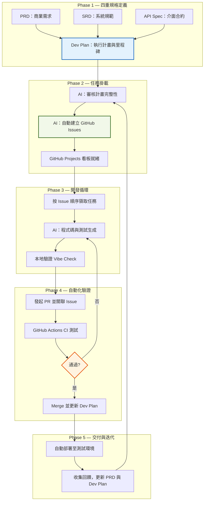
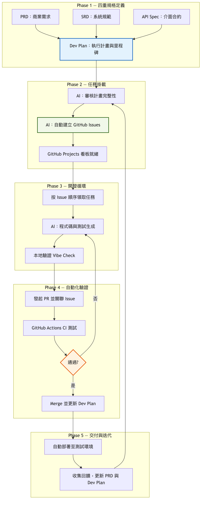
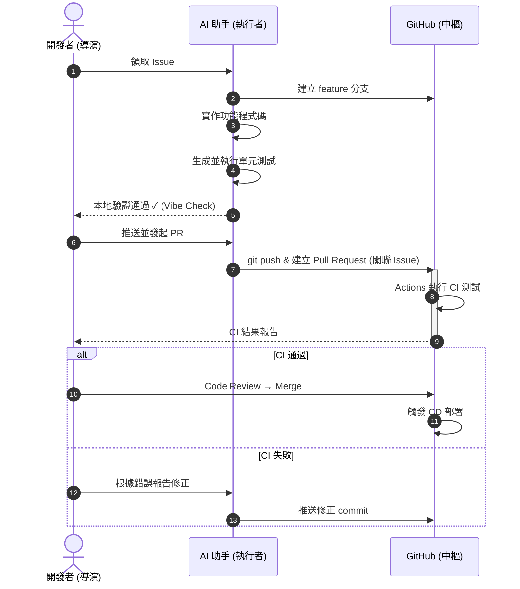
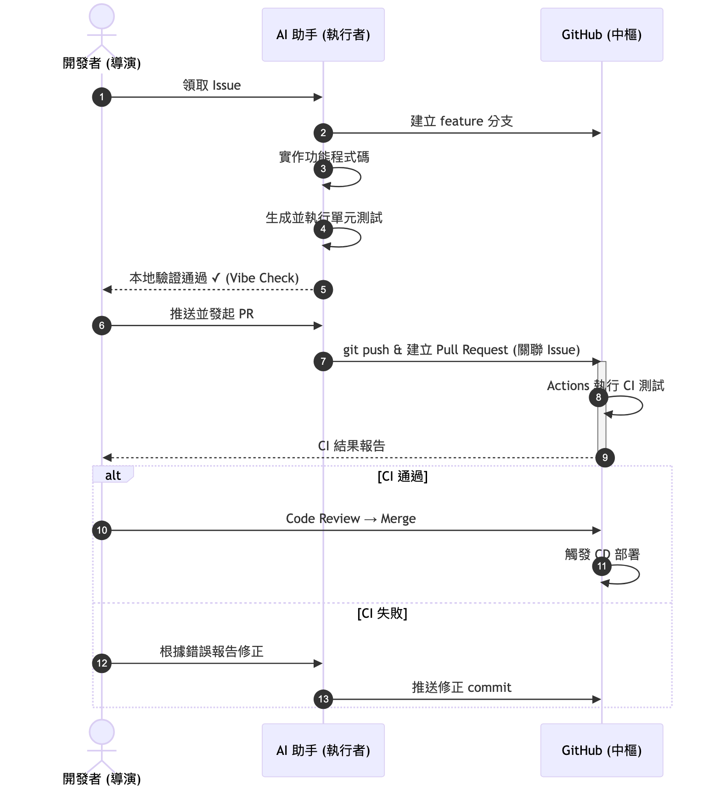

# Vibe-SDLC：AI 輔助軟體開發生命週期 (SOP v5.0)

> **Vibe-SDLC** 定義了一套以 AI 為執行核心、人類為決策核心的軟體開發流程。
> 透過結構化的規格文件、自動化任務管理與 CI/CD 門檻，確保 Vibe Coding 的產出品質與可追溯性。

---

## 核心角色

| 角色 | 定位 | 核心職責 | 關鍵交付物 |
|------|------|----------|------------|
| **開發者 (導演)** | 方向決策與品質審核 | 定義商業與系統規範；審查 API 正確性；PR 最終確認 | PRD, SRD, Dev Plan |
| **AI 助手 (執行者)** | 自動化執行與修正 | 將規格轉換為程式碼與測試；自動化 GitHub 任務管理；根據 CI 報錯自我修正 | Code, Tests, PR Summary |
| **GitHub (中樞)** | 版本管理與自動化檢驗 | 存放所有真相來源 (Docs)；執行 CI/CD 檢驗 (Actions)；追蹤任務進度 (Projects) | CI Reports, Deployments |

---

## 流程總覽





---

## Phase 1：四重規格定義 (Quad-Spec)

在 GitHub `/docs` 目錄中建立所有真相來源（Single Source of Truth）。

| 文件 | 用途 | 內容重點 |
|------|------|----------|
| **PRD.md** | 商業需求規格 | 功能清單、資料欄位定義、使用者故事（白話表格） |
| **SRD.md** | 系統技術規格 | 系統架構、技術棧、安全性要求、效能指標 |
| **API_Spec.yaml** | 前後端通訊合約 | OpenAPI 格式，定義所有端點、請求/回應結構 |
| **Dev_Plan.md** | 執行計畫 | 里程碑 (Milestones)、任務拆解 (Tasks)、依賴關係 (Dependencies) |

### Dev Plan 結構建議

```markdown
## Milestone 1：基礎設施
- [ ] Task 1.1：環境建置與 CI/CD 配置
- [ ] Task 1.2：資料庫 Schema 設計與遷移
      ↳ 依賴：無

## Milestone 2：核心功能
- [ ] Task 2.1：使用者認證模組
      ↳ 依賴：Task 1.2
- [ ] Task 2.2：核心業務邏輯
      ↳ 依賴：Task 2.1
```

---

## Phase 2：任務掛載 (Planning → Issues)

**目的：將計畫轉換為可追蹤的工作項目。**

1. **計畫審核**
   AI 讀取 `Dev_Plan.md`，交叉比對 SRD 與 API Spec，確認無遺漏。
   > 提示詞範例：`"讀取 docs/Dev_Plan.md，確認步驟是否涵蓋 SRD 中的安全實作與非功能性需求。"`

2. **自動建立 Issues**
   AI 根據里程碑逐一建立 GitHub Issues，標註優先級、標籤與依賴。
   > 提示詞範例：`"根據 Dev_Plan.md 中的 M1 里程碑，在 GitHub 建立對應 Issues，標註 priority 與 label。"`

3. **看板同步**
   GitHub Projects 自動抓取 Issues，形成視覺化進度追蹤。

### 為什麼這一步至關重要？

- **避免遺漏**：非功能性任務（監控、日誌、備份）若未轉為 Issue，極易被忽略。
- **進度透明化**：非技術人員可透過看板直觀了解執行進度。
- **上下文隔離**：AI 處理單一 Issue 時更專注，減少無關資訊干擾。

---

## Phase 3：開發循環 (Execution Loop)





### 執行要點

1. **按序取票**：從 GitHub Projects 的 `Todo` 欄位依優先級挑選 Issue。
2. **精準實作**：AI 參考 SRD 技術限制與 API Spec 格式，在 feature 分支上開發。
   > 提示詞範例：`"讀取 Issue #5，參考 SRD 的技術限制與 API_Spec 的格式，實作 feature 分支。"`
3. **本地守門 (Vibe Check)**：AI 同步生成單元測試並在本地通過驗證後，才進入下一階段。

---

## Phase 4：自動化驗證 (CI/CD Gates)

1. **PR 發起**：AI 總結變更摘要並關聯對應 Issue（如 `Closes #5`）。
2. **Actions 驗證**：
   - 合約測試（API 規格一致性）
   - 安全性掃描（依賴漏洞、OWASP 檢查）
   - 效能壓測（回應時間、吞吐量）
3. **人工審閱**：開發者進行 Code Review，確認邏輯正確性。
4. **合併與更新**：Merge 後自動將 `Dev_Plan.md` 中對應步驟標記為 `Completed`。

---

## Phase 5：交付與迭代 (Release & Feedback)

1. **自動部署**：CD pipeline 將產出推送至測試環境。
2. **回饋收集**：蒐集使用者回饋與問題報告。
3. **迭代循環**：根據回饋更新 `PRD.md` 與 `Dev_Plan.md`，回到 **Phase 2** 啟動下一輪開發。

---

## 附錄：提示詞速查表

| 階段 | 場景 | 提示詞範例 |
|------|------|------------|
| Phase 1 | 規格審查 | `"比對 PRD 與 SRD，列出尚未在 SRD 中定義技術方案的商業需求。"` |
| Phase 2 | 建立 Issues | `"根據 Dev_Plan.md 的 M1 里程碑，建立 GitHub Issues 並標註優先級。"` |
| Phase 3 | 功能開發 | `"讀取 Issue #N，參考 SRD 與 API_Spec，在 feature 分支實作。"` |
| Phase 4 | PR 建立 | `"總結本次變更，發起 PR 並關聯 Issue #N。"` |
| Phase 5 | 回饋處理 | `"根據以下用戶回饋，更新 PRD 並在 Dev_Plan 新增對應任務。"` |
