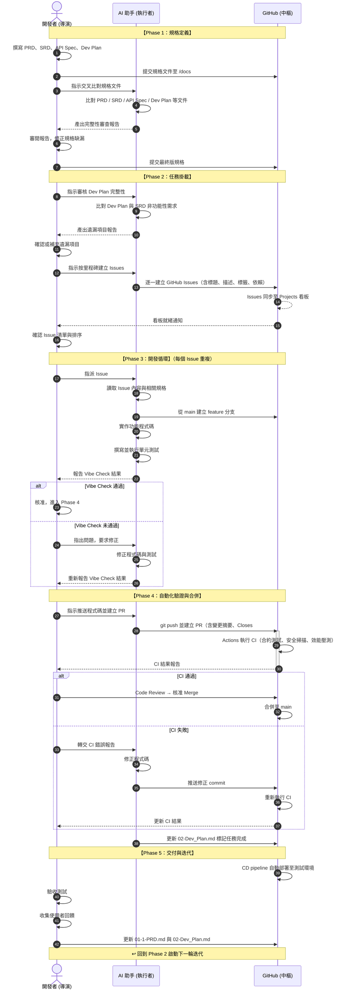
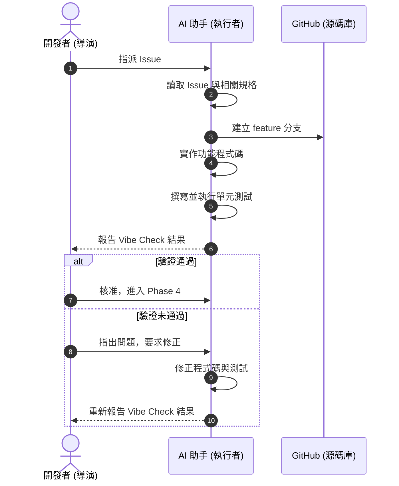

# Vibe-SDLC：AI 輔助軟體開發生命週期標準作業程序

> **版本**：v6.0 ｜ **最後更新**：2026-03-12

---

## 1. 目的與適用範圍

本 SOP 定義了一套以 **人類決策、AI 執行、GitHub 管控** 為核心的軟體開發生命週期流程。
適用於所有採用 AI 輔助開發（Vibe Coding）模式的專案。

---

## 2. 角色定義與職責

### 2.1 開發者（導演）

> 專案的決策者與最終品質負責人。

| 職責範疇 | 具體內容 |
|----------|----------|
| 需求定義 | 撰寫 PRD（商業需求）與 SRD（系統規格） |
| 合約制定 | 定義 API Spec，確保前後端介面一致 |
| 計畫規劃 | 編寫 Dev Plan，拆解里程碑與任務 |
| 品質審核 | 審閱 AI 產出的規格審查報告、Code Review、PR 核准 |
| 方向決策 | 處理 CI 失敗的判斷（修正 or 調整規格）、回饋優先級排序 |

### 2.2 AI 助手（執行者）

> 依據規格與指令執行開發任務，不做未授權的決策。

| 職責範疇 | 具體內容 |
|----------|----------|
| 規格審查 | 交叉比對 PRD / SRD / API Spec / Dev Plan，產出差異報告 |
| 任務建立 | 根據 Dev Plan 自動建立 GitHub Issues |
| 程式開發 | 在 feature 分支上實作程式碼，遵循 SRD 技術規範 |
| 測試生成 | 撰寫並執行單元測試，確保本地驗證通過 |
| PR 管理 | 推送程式碼、建立 PR、撰寫變更摘要、關聯 Issue |
| 錯誤修正 | 根據 CI 失敗報告修正程式碼並重新提交 |

### 2.3 GitHub（中樞系統）

> 自動化運作的基礎設施，無需人工介入。

| 職責範疇 | 具體內容 |
|----------|----------|
| 版本管理 | 儲存所有真相來源（規格文件、程式碼） |
| CI/CD 執行 | 透過 Actions 執行自動化測試、安全掃描、部署 |
| 任務追蹤 | 透過 Projects 看板管理 Issue 狀態與進度 |
| 通知觸發 | CI 結果通知、PR 狀態變更通知 |

---

## 3. 流程總覽

完整循序圖：



> 已渲染至：images/full-sequence.png

---

## 4. Phase 1：規格定義 (Quad-Spec)

### 4.1 目的

建立專案的完整真相來源（Single Source of Truth），此階段應充分與AI討論生成高品質規格文件與計畫，所有後續工作皆以此為依據。

### 4.2 前置條件

- GitHub 倉庫已建立
- 專案目錄結構已初始化（含 `/docs` 目錄）

### 4.3 交付物


| 文件 | 格式 | 存放路徑 | 說明 |
|------|------|----------|------|
| 產品需求文件(PRD) | `01-1-PRD.md` | `/docs/01-1-PRD.md` | 偏重產品面或客戶的需求及要求，可能衍生 UI/UX 需求。 |
| 系統需求文件(SRD) | `01-2-SRD.md` | `/docs/01-2-SRD.md` | 偏重技術棧、框架以及系統在安全及性能上的要求。 |
| API 介面規格 (API Spec) | `01-3-API_Spec.md` | `/docs/01-3-API_Spec.md` | API規格說明 |
| API 介面合約 | `API_Spec.yaml` | `/docs/API_Spec.yaml` | Open API 規格 |
| 開發執行計畫(Dev Plan) | `02-Dev_Plan.md` | `/docs/02-Dev_Plan.md` |  |


請注意：每個規格都應該賦予**規格編號**以利後續追蹤與討論。


### 4.4 操作步驟

| 步驟 | 執行者 | 操作 | 產出 |
|------|--------|------|------|
| 1 | **開發者** | 撰寫 PRD：定義功能清單、使用者故事、資料欄位（白話表格） | `01-1-PRD.md` |
| 2 | **開發者** | 撰寫 SRD：定義系統架構、技術棧、安全性要求、效能指標 | `01-2-SRD.md` |
| 3 | **開發者** | 定義 API Spec：以 OpenAPI 格式定義所有端點、請求/回應結構 | `01-3-API_Spec.md`,<br />`API_Spec.yaml` |
| 4 | **開發者** | 撰寫 Dev Plan：拆解里程碑、任務清單、任務間依賴關係 | `02-Dev_Plan.md` |
| 5 | **開發者** | 將以上四份文件提交至 GitHub `/docs` 目錄 | Git commit |
| 6 | **AI 助手** | 交叉比對/docs格文件，產出完整性審查報告 | 審查報告 |
| 7 | **開發者** | 審閱報告，修正規格缺漏後重新提交 | 最終版規格 |

### 4.5 Dev Plan 格式規範

可依需求規格相關文件，生成 Dev Plan 文件，然後與AI助手討論並優化：

  - 計畫視規模可以區分階段
  - 每個階段以代辦事項的方式列表，每個事項，包含：
    - 任務編號: 任務目標:
      - 依賴(前置任務/條件)
      - 輸入(參考)文件
      - 執行步驟
      - 產出
      - 驗證方式(驗證方式可能參考其它測試計畫)
      - 優先級(重要性)


```markdown
## Milestone 1：基礎設施
- [ ] Task1.1：環境建置與 CI/CD 配置
      - 依賴: (無)
      - 輸入: (無)
      - 執行步驟: 執行技能 '初始化CICD Project1'
      - 產出: 無
      - 驗證: TEST_PLAN_ENV.md -> T1.1
      - 優先級: P0
- [ ] Task1.2：資料庫 Schema 設計與遷移
      - 依賴: Task1.1
      - 輸入: '/db/DB.md','/db/DB_SCHEMA.SQL'
      - 執行步驟: 
        1. 執行技能 '初始化數據庫'
        2. 測試數據庫連線
      - 產出: 無
      - 驗證: TEST_PLAN_ENV.md -> T1.2
      - 優先級: P0
## Milestone 2：核心功能
- [ ] Task 2.1：使用者認證模組
      - 依賴: Task1.2
      - 輸入: '/docs/01-1-PRD.md','/docs/UI_UX.md','01-2-SRD.md','/db/DB.md'
      - 執行步驟: 開發使用者認證模組。
      - 產出: 使用者認證模組相關源碼。
      - 驗證: TEST_PLAN_UI.md -> T2.1
      - 優先級: P0
- [ ] ...
```

### 4.6 完成條件

- [ ] 規格文件皆已提交至 `/docs`
- [ ] AI 審查報告無未解決的遺漏項目
- [ ] 開發者確認規格定稿

---

## 5. Phase 2：任務掛載 (Planning → Issues)

### 5.1 目的

將 Dev Plan 轉換為 GitHub Issues，使每項任務皆可追蹤、可分派、可度量。

### 5.2 前置條件

- Phase 1 所有完成條件已達成
- GitHub Projects 看板已建立

### 5.3 操作步驟

| 步驟 | 執行者 | 操作 | 產出 |
|------|--------|------|------|
| 1 | **開發者** | 指示 AI 審核 Dev Plan 完整性 | — |
| 2 | **AI 助手** | 讀取 `02-Dev_Plan.md`，交叉比對 SRD 中的安全實作與非功能性需求，列出遺漏項目 | 審核報告 |
| 3 | **開發者** | 審閱報告，確認或補充遺漏項目 | 核准結果 |
| 4 | **開發者** | 指示 AI 按里程碑建立 Issues | — |
| 5 | **AI 助手** | 依 Dev Plan 逐一建立 GitHub Issues，每個 Issue 包含：標題、描述、優先級標籤、里程碑標籤、依賴關係說明 | GitHub Issues |
| 6 | **GitHub** | 自動將 Issues 同步至 Projects 看板 | 看板就緒 |
| 7 | **開發者** | 確認看板上的 Issue 清單與排序是否正確 | 最終確認 |

### 5.4 Issue 格式規範

每個 Issue 應包含以下欄位：

```markdown
## 任務描述
[具體要實作的功能或工作內容]

## 產出文件
- [ ] [文件 1]（如適用）
- [ ] [文件 2]（如適用）

## 驗收標準
- [ ] [標準 1]
- [ ] [標準 2]

## 技術參考
- SRD 相關章節：[章節名稱]
- API 端點：[端點路徑]（如適用）
- 其它參考文件

## 依賴
- 前置任務：#[Issue 編號]（如適用）

## 標籤
- 優先級：P0 / P1 / P2
- 里程碑：M1 / M2 / M3 / M4
- 類型：feature / infra / security / test
```

### 5.5 完成條件

- [ ] Dev Plan 中的所有任務皆已轉為 GitHub Issues
- [ ] 每個 Issue 皆有完整的驗收標準與標籤
- [ ] Projects 看板已正確顯示所有 Issues

---

## 6. Phase 3：開發循環 (Execution Loop)

### 6.1 目的

按 Issue 順序逐一完成開發，確保每個任務皆通過本地驗證後才進入審核流程。

### 6.2 前置條件

- Phase 2 所有完成條件已達成
- Projects 看板中有狀態為 `Todo` 的 Issue

### 6.3 操作步驟

| 步驟 | 執行者 | 操作 | 產出 |
|------|--------|------|------|
| 1 | **開發者** | 從看板 `Todo` 欄位挑選最高優先級 Issue，指派給 AI | — |
| 2 | **AI 助手** | 讀取 Issue 內容，確認理解任務範圍與驗收標準 | 任務確認 |
| 3 | **AI 助手** | 從 `main` 建立 feature 分支（命名：`feature/issue-N-簡述`） | feature 分支 |
| 4 | **AI 助手** | 參考 SRD 技術規範與 API Spec，實作功能程式碼 | 功能程式碼 |
| 5 | **AI 助手** | 撰寫對應的單元測試 | 測試程式碼 |
| 6 | **AI 助手** | 執行本地測試，確認全部通過 | 測試結果 |
| 7 | **AI 助手** | 向開發者報告本地驗證結果（Vibe Check） | 驗證報告 |
| 8 | **開發者** | 審閱 Vibe Check 結果，決定是否進入 Phase 4 | 核准 / 駁回 |
| — | *若駁回* | **開發者**指出問題，回到步驟 4 修正 | — |

### 6.4 循序圖



> 已渲染至 images/sequence.png


### 6.5 完成條件

- [ ] 功能程式碼已完成且符合 SRD 規範
- [ ] 單元測試全部通過
- [ ] 開發者已核准 Vibe Check 結果

---

## 7. Phase 4：自動化驗證與合併 (CI/CD Gates)

### 7.1 目的

透過自動化測試與人工審閱雙重門檻，確保合併至 `main` 的程式碼符合品質標準。

### 7.2 前置條件

- Phase 3 所有完成條件已達成（Vibe Check 通過）

### 7.3 操作步驟

| 步驟 | 執行者 | 操作 | 產出 |
|------|--------|------|------|
| 1 | **開發者** | 指示 AI 推送程式碼並建立 PR | — |
| 2 | **AI 助手** | 執行 `git push`，建立 Pull Request，內容包含：變更摘要、關聯 Issue（`Closes #N`）、測試結果 | Pull Request |
| 3 | **GitHub** | 自動觸發 Actions，執行以下檢查： | CI 報告 |
|   |          | — 合約測試（API 規格一致性） | |
|   |          | — 安全性掃描（依賴漏洞、OWASP） | |
|   |          | — 效能壓測（回應時間、吞吐量） | |
| 4a | *CI 通過* | **開發者**進行 Code Review，審閱程式碼邏輯 | Review 意見 |
| 4b | *CI 失敗* | **開發者**將 CI 報告轉交 AI，回到步驟修正 ↓ | — |
| 5b | *CI 失敗* | **AI 助手**根據 CI 錯誤報告修正程式碼，推送新 commit | 修正 commit |
|    |           | → 回到步驟 3，GitHub 重新執行 CI | — |
| 5a | *Review 通過* | **開發者**點擊 Merge，合併至 `main` | Merge commit |
| 6 | **GitHub** | 觸發 CD pipeline（如已配置） | 部署 |
| 7 | **AI 助手** | 將 `02-Dev_Plan.md` 中對應任務標記為 `[x] Completed` | Dev Plan 更新 |

### 7.4 PR (Pull Request / Merge Request) 格式規範

```markdown
## 變更摘要
[一段話描述本次變更的目的與內容]

## 關聯 Issue
Closes #N

## 變更清單
- [變更項目 1]
- [變更項目 2]

## 測試結果
- 單元測試：✅ 全部通過（N/N）
- 本地驗證：✅ Vibe Check 通過
```

### 7.5 完成條件

- [ ] CI 全部通過（綠燈）
- [ ] 開發者 Code Review 核准
- [ ] PR 已合併至 `main`
- [ ] Dev Plan 對應任務已標記完成

---

## 8. Phase 5：交付與迭代 (Release & Feedback)

### 8.1 目的

將已完成的功能部署至測試環境，收集回饋並啟動下一輪迭代。

### 8.2 前置條件

- 當前里程碑的所有 Issue 皆已合併
- Dev Plan 中對應里程碑的任務皆標記為完成

### 8.3 操作步驟

| 步驟 | 執行者 | 操作 | 產出 |
|------|--------|------|------|
| 1 | **GitHub** | CD pipeline 自動部署至測試環境 | 測試環境可用 |
| 2 | **開發者** | 在測試環境進行驗收測試 | 驗收結果 |
| 3 | **開發者** | 收集使用者回饋與問題報告 | 回饋清單 |
| 4 | **開發者** | 根據回饋更新 `01-1-PRD.md`（需求變更）與 `02-Dev_Plan.md`（新增任務） | 更新後的規格 |
| 5 | — | **回到 Phase 2**，啟動下一輪迭代 | — |

### 8.4 完成條件

- [ ] 測試環境部署成功且可存取
- [ ] 驗收測試通過
- [ ] 回饋已整理並反映至規格文件
- [ ] 下一輪迭代的 Dev Plan 已更新

---

## 附錄 A：提示詞速查表

| 階段 | 場景 | 執行者 → AI 的提示詞 |
|------|------|----------------------|
| Phase 1 | 規格審查 | `"交叉比對 /docs 下的 01-1-PRD、01-2-SRD、01-3-API_Spec、02-Dev_Plan，列出不一致或遺漏的項目。"` |
| Phase 2 | 計畫審核 | `"讀取 docs/02-Dev_Plan.md，確認是否涵蓋 SRD 中的安全實作與非功能性需求。"` |
| Phase 2 | 建立 Issues | `"根據 02-Dev_Plan.md 的 M1 里程碑，建立 GitHub Issues，包含驗收標準、優先級與標籤。"` |
| Phase 3 | 功能開發 | `"讀取 Issue #N，參考 01-2-SRD 技術規範與 01-3-API_Spec，在 feature 分支上實作。"` |
| Phase 4 | 建立 PR | `"推送程式碼，建立 PR 並關聯 Issue #N，撰寫變更摘要。"` |
| Phase 4 | CI 修正 | `"讀取 CI 失敗報告，修正錯誤後推送新 commit。"` |
| Phase 5 | 回饋處理 | `"根據以下回饋更新 01-1-PRD，並在 02-Dev_Plan 中新增對應任務。"` |

---

## 附錄 B：文件與路徑對照表

| 文件 | 路徑 | 維護者 | 更新時機 |
|------|------|--------|----------|
| PRD | `/docs/01-1-PRD.md` | 開發者 | Phase 1 建立、Phase 5 迭代更新 |
| SRD | `/docs/01-2-SRD.md` | 開發者 | Phase 1 建立、需求變更時更新 |
| API Spec (說明) | `/docs/01-3-API_Spec.md` | 開發者 | Phase 1 建立、介面變更時更新 |
| API Spec (合約) | `/docs/API_Spec.yaml` | 開發者 | Phase 1 建立、介面變更時更新 |
| Dev Plan | `/docs/02-Dev_Plan.md` | 開發者建立、AI 更新狀態 | Phase 1 建立、Phase 4 標記完成、Phase 5 新增任務 |
