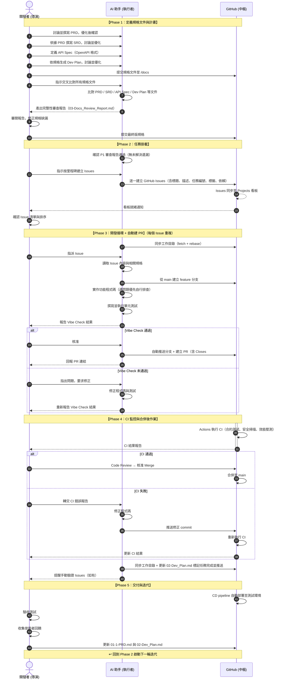
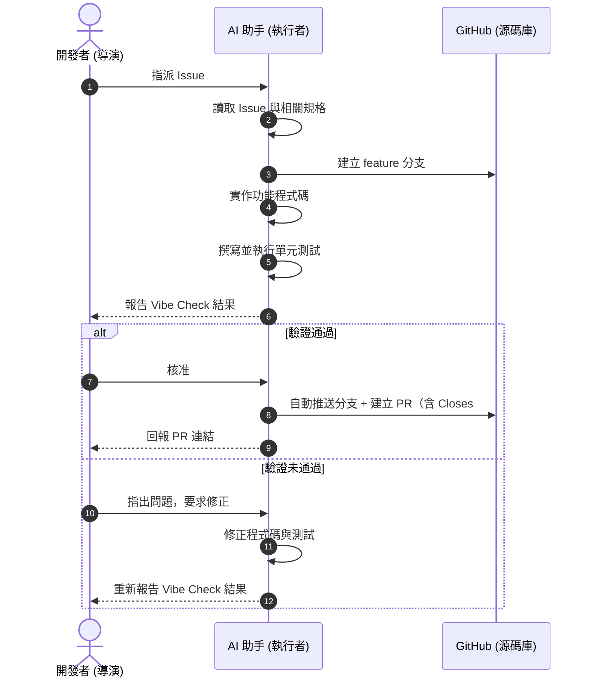

# Vibe-SDLC：AI 輔助軟體開發生命週期標準作業程序

> **版本**：v8.0 ｜ **最後更新**：2026-03-18

---

## 1. 目的與適用範圍

本 SOP 定義了一套以 **人類決策、AI 執行、GitHub 管控** 為核心的軟體開發生命週期流程。
適用於所有採用 AI 輔助開發（Vibe Coding）模式的專案。

---

## 2. 角色定義與職責

### 2.1 開發者（導演）

> 專案的決策者與最終品質負責人。

| 職責範疇 | 具體內容 |
|----------|----------|
| 需求定義 | 撰寫 PRD（商業需求）與 SRD（系統規格） |
| 合約制定 | 定義 API Spec，確保前後端介面一致 |
| 計畫規劃 | 編寫 Dev Plan，拆解里程碑與任務 |
| 品質審核 | 審閱 AI 產出的規格審查報告、Code Review、PR 核准 |
| 方向決策 | 處理 CI 失敗的判斷（修正 or 調整規格）、回饋優先級排序 |

### 2.2 AI 助手（執行者）

> 依據規格與指令執行開發任務，不做未授權的決策。

| 職責範疇 | 具體內容 |
|----------|----------|
| 規格審查 | 交叉比對 PRD / SRD / API Spec / Dev Plan，產出完整性審查報告 |
| 任務建立 | 根據 Dev Plan 自動建立 GitHub Issues，並建立 Project 看板 |
| 程式開發 | 在 feature 分支上實作程式碼，遵循 SRD 技術規範 |
| 測試生成 | 撰寫並執行單元測試，確保本地驗證通過 |
| 自主排查 | 遇到問題、Bug 或錯誤時，優先自行調查與解決，無法解決時才上報開發者 |
| PR 管理 | Vibe Check 通過後自動推送分支、建立 PR（含 `Closes #N`）、回報 PR 連結 |
| 錯誤修正 | 根據 CI 失敗報告修正程式碼並重新提交 |

**角色代號（Role Registry）**：Dev Plan 中以代號標識角色，全文保持一致，支援 Multi Sub-Agent 並行開發。

| 類別 | 代號 | 名稱 | 說明 |
|------|------|------|------|
| 🧑 人類 | H-Director | 導演 | 最高決策、規格審查、Milestone 驗收、PR 合併 |
| 🧑 人類 | H-Reviewer | 審查員 | 特定領域審查（安全/合規性），可由 Director 兼任 |
| 🧑 人類 | H-UxReviewer | UX 審查員 | UX 相關審查（視覺效果、互動體驗、裝置相容性），可由 Director 兼任 |
| 🤖 AI | A-Main | 主代理 | 統籌拆解 Issue、協調 Sub Agents、整合驗證 |
| 🤖 AI | A-Backend | 後端子代理 | 專注後端 API、DB、ORM |
| 🤖 AI | A-Frontend | 前端子代理 | 專注 UI 組件、頁面、狀態管理 |
| 🤖 AI | A-QA | 測試子代理 | E2E 測試、覆蓋率 |
| 🤖 AI | A-DevOps | 部署子代理 | CI/CD、Docker、監控 |

### 2.3 GitHub（中樞系統）

> 自動化運作的基礎設施，無需人工介入。

| 職責範疇 | 具體內容 |
|----------|----------|
| 版本管理 | 儲存所有真相來源（規格文件、程式碼） |
| CI/CD 執行 | 透過 Actions 執行自動化測試、安全掃描、部署 |
| 任務追蹤 | 透過 Projects 看板管理 Issue 狀態與進度 |
| 通知觸發 | CI 結果通知、PR 狀態變更通知 |

---

## 3. 流程總覽

完整循序圖：



> 已渲染至：images/full-sequence.png

---

## 4. Phase 1：定義規格文件與計畫

### 4.1 目的

建立專案的完整真相來源（Single Source of Truth）。此階段應充分與 AI 討論生成高品質規格文件與計畫，所有後續工作皆以此為依據。

### 4.2 前置條件

- GitHub 倉庫已建立
- 專案目錄結構已初始化（含 `/docs` 目錄）

### 4.3 交付物

| 文件 | 檔名 | 存放路徑 | 說明 |
|------|------|----------|------|
| 產品需求文件 (PRD) | `01-1-PRD.md` | `/docs/01-1-PRD.md` | 偏重產品面或客戶需求，可能衍生 UI/UX 需求 |
| 系統需求文件 (SRD) | `01-2-SRD.md` | `/docs/01-2-SRD.md` | 偏重技術棧、框架以及系統安全性與效能要求 |
| API 介面規格 | `01-3-API_Spec.md` | `/docs/01-3-API_Spec.md` | API 規格說明 |
| API 介面合約 | `API_Spec.yaml` | `/docs/API_Spec.yaml` | OpenAPI 規格 |
| UI/UX 設計文件 | `01-4-UI_UX_Design.md` | `/docs/01-4-UI_UX_Design.md` | 視覺與互動設計規格（如適用） |
| 開發執行計畫 | `02-Dev_Plan.md` | `/docs/02-Dev_Plan.md` | 里程碑、任務拆解、角色定義、依賴關係 |
| 規格審查報告 | `03-Docs_Review_Report.md` | `/docs/03-Docs_Review_Report.md` | 交叉比對結果、不一致與遺漏項目 |
| CI/CD 規格文件（選用） | `04-CI_CD_Spec.md` | `/docs/04-CI_CD_Spec.md` | CI Workflow 定義、品質閘門、Docker 部署配置（複雜專案建議獨立） |

**重要**：
- 每項規格都應賦予**規格編號**以利後續追蹤與討論。
- 每個任務都應賦予**任務編號**以利後續追蹤與討論。

### 4.4 操作步驟

| 步驟 | 執行者 | 操作 | 產出 |
|------|--------|------|------|
| 1 | **開發者** | 撰寫 PRD：定義功能清單、使用者故事、資料欄位，與 AI 討論並優化 | `01-1-PRD.md` |
| 2 | **開發者** | 撰寫 SRD：PRD 定義完成後，定義系統架構、技術棧、安全性要求、效能指標，與 AI 討論並優化 | `01-2-SRD.md` |
| 3 | **開發者** | 定義 API Spec：以 OpenAPI 格式定義所有端點、請求/回應結構 | `01-3-API_Spec.md`, `API_Spec.yaml` |
| 4 | **開發者** | 撰寫 Dev Plan：PRD、SRD、API Spec 定義完成後，拆解里程碑、任務清單、任務間依賴關係，與 AI 討論並優化 | `02-Dev_Plan.md` |
| 5 | **開發者** | 確認以上文件均已提交至 `/docs` 目錄並推送至倉庫 | Git commit & push |
| 6 | **AI 助手** | 交叉比對 `/docs` 下所有規格文件，產出完整性審查報告 | `03-Docs_Review_Report.md` |
| 7 | **開發者** | 審閱報告，修正規格缺漏後重新提交 | 最終版規格 |

### 4.5 Dev Plan 格式規範

可依需求規格相關文件（PRD、SRD、API Spec 等）生成 Dev Plan，然後與 AI 討論並優化。

> 參考範例：`skills/vibe-sdlc-p1-spec/examples/docs/02-Dev_Plan.md`

#### 核心設計原則

1. **面向 AI Agentic Coding**：計畫以 Main Agent + Sub Agents 為執行單位，非傳統人類團隊。
2. **API First 契約驅動**：前後端透過 `API_Spec.yaml` 解耦，Sub Agents 可高度並行開發。
3. **Human Gate 機制**：每個 Milestone 設有人類驗收門（⛳），由人類導演決定是否進入下一階段。

#### 文件結構（必須包含以下章節）

1. **角色定義 (Role Registry)**：全文唯一角色定義來源（見 2.2 節角色代號表）
2. **項目概況與時間表**：里程碑 Gantt 圖（Mermaid）、工作量估算
3. **里程碑定義**：每個 Milestone 的目標、AI 執行策略、交付物、人類決策點
4. **任務清單**：任務總覽表格 + 任務詳細描述 + 並行群組視覺化（Mermaid）
5. **技術實施方案**：前後端技術棧、資料庫與部署配置
6. **風險識別與應對**：AI 開發視角的風險（Regression、上下文不同步、除錯迴圈）
7. **質量保證計畫 (Vibe Check)**：CI/CD 閘口、Human-in-the-Loop 審查
8. **溝通與協作**：狀態同步中心、文件存取約定（Single Source of Truth）

#### 任務總覽表格格式

```markdown
| ID | 任務名稱 | 優先級 | 負責角色 | 前置任務 | PR 策略 | 預估耗時 |
|----|---------|-------|---------|---------|--------|----------|
| T-101 | [任務名稱] | P0 | A-Backend | — | 與 T-102 合併 | ~N AI Sessions |
| T-102 | [任務名稱] | P0 | A-Backend | — | 與 T-101 合併 | ~N AI Sessions |
| T-103 | [任務名稱] | P0 | A-Frontend | — | 獨立 PR | ~N AI Sessions |
| T-104 | [任務名稱] | P0 | A-DevOps | T-102, T-103 | 獨立 PR | ~N AI Sessions |
| ⛳ M1 | M1 驗收門 | P0 | H-Director | T-103, T-104 | — | ~N HRH |
```

- **前置任務**：直接在總覽表中列出依賴關係，使依賴鏈一目了然。若無前置任務填 `—`。
- **PR 策略**：同一 Agent 的多個無依賴任務應合併為一個 PR（如「與 T-102 合併」），其餘填「獨立 PR」。驗收門填 `—`。
- **預估耗時**：AI 角色用 `AI Sessions`（一次完整 Agent 對話執行）；人類角色用 `HRH`（Human Review Hours）。
- **優先級**：`P0` 關鍵路徑必須完成｜`P1` 重要但非阻塞｜`P2` 建議完成（時間允許）｜`P3` 可選（有加分效果）

#### 任務詳細描述格式

```markdown
**T-{ID}：{任務名稱}**
- **任務描述**：概述該任務的目標
- **主要步驟**：
  1. 步驟一：具體操作描述
  2. 步驟二：具體操作描述
- **前置任務**：前置任務 ID，若無填 `（無）`
- **輸入**：依賴或參考的文件，若無填 `（無）`
- **產出**：此任務的輸出/產出文件或源碼，若無填 `（無）`
- **驗證**：
  - ✅ 自動：可在 CI 中自動執行的驗證（單元測試、lint、type check、build）
  - 👁️ 手動：需人工操作的驗證（視覺效果、裝置測試、外部 API 整合）
- **優先級**：P0 / P1 / P2 / P3
```

> **驗證分類**：每個驗證條件必須標記為 `✅ 自動` 或 `👁️ 手動`，明確區分 CI 可執行與需人工操作的項目。

#### 並行與依賴規則

- 使用「**並行群組 (G)**」標記可同時執行的任務，同一群組內可由不同 Sub Agents 同時開發
- 同一並行群組內，同一 Agent 的多個任務在 Agent 內部為**依序執行**，但與其他 Agent 的任務仍為跨 Agent 並行
- 群組之間依序進行，以 ⛳ **驗收門 (Human Gate)** 作為分界
- 使用 Mermaid `flowchart` 的 fork/join 語法視覺化並行關係

#### Dev Plan 常見錯誤防範

- **CI/CD 時序原則**：CI Workflow 必須在 M1 建立，正確依賴鏈為 `骨架任務 → CI 任務 → 功能開發任務`
- **Bootstrap PR 規則**：CI 建立前的初始化 PR 由 H-Director 直接審查合併，不經過 CI 閘門
- **手動驗證任務**：`👁️ 手動` 驗證項應建立獨立 Issue，指派給對應審查角色（H-UxReviewer / H-Reviewer / H-Director）
- **任務拆分原則**：功能性質不同的工作不應合併為同一任務

#### Git 協作策略 (Multi Sub Agent)

當多個 Sub Agents 並行開發時，Dev Plan 應包含：

- **Worktree 使用**：每個 Sub Agent 使用獨立的 Git Worktree，避免 checkout 切換衝突
- **分支命名**：`feat/<agent>/<issue-N>-<簡述>`（如 `feat/backend/issue-12-auth-api`）
- **Bootstrap 階段**：CI 建立前的 PR 由 H-Director 直接審查，不經 CI 閘門
- **雙層 PR 審查**：Sub Agent PR → CI → A-Main 初審（範圍確認）→ H-Director 終審 & Merge
- **PR 範圍限制**：Sub Agent 僅修改負責目錄內的檔案
- **合併衝突**：由 A-Main 負責 rebase 解決

#### 繪圖規範

文件中所有流程圖、時間表、依賴關係圖**一律使用 Mermaid 語法**，禁止使用 ASCII Art。建議：
- 里程碑時間表：`gantt`
- 任務分發流程：`flowchart LR`
- 並行群組視覺化：`flowchart TB`（fork/join 模式）

### 4.6 審查報告格式

當執行步驟 6（交叉比對規格文件）時，按以下格式產出報告至 `/docs/03-Docs_Review_Report.md`：

```markdown
# 規格完整性審查報告

## 審查範圍
- 比對文件：01-1-PRD.md, 01-2-SRD.md, 01-3-API_Spec.md, 02-Dev_Plan.md, ...

## 不一致項目
| 編號 | 文件 | 不一致描述 | 建議修正 |
|------|------|-----------|---------|

## 遺漏項目
| 編號 | 文件 | 遺漏描述 | 應補充至 |
|------|------|---------|---------|

## 結論
- 不一致項目：N 項
- 遺漏項目：N 項
- 建議：[通過 / 需修正後重新審查]
```

### 4.7 完成條件

- [ ] 規格文件皆已提交至 `/docs`
- [ ] AI 審查報告無未解決的遺漏項目
- [ ] 開發計畫合理可行
- [ ] 開發者確認規格定稿

---

## 5. Phase 2：任務掛載 (Planning → Issues)

### 5.1 目的

將 Dev Plan 轉換為 GitHub Issues，使每項任務皆可追蹤、可分派、可度量，並建立 Project 看板。

### 5.2 前置條件

- Phase 1 所有完成條件已達成（含 `03-Docs_Review_Report.md` 無未解決項目）
- `/docs` 目錄下所有規格文件（含 `API_Spec.yaml` 等）皆已提交

### 5.3 操作步驟

| 步驟 | 執行者 | 操作 | 產出 |
|------|--------|------|------|
| 1 | **AI 助手** | 確認 P1 審查報告（`03-Docs_Review_Report.md`）通過，無未解決的遺漏項目 | 確認結果 |
| 2 | **AI 助手** | 確認 `gh` CLI 已認證，詢問 GitHub repo 名稱與 H-Director 的 GitHub username | 基本資訊 |
| 3 | **開發者** | 指示 AI 按里程碑建立 Issues（或全部） | — |
| 4 | **AI 助手** | 建立所需的 Labels（優先級、里程碑、類型、角色、審查類型）與 Milestones | Labels + Milestones |
| 5 | **AI 助手** | 依 Dev Plan 逐一建立 GitHub Issues（開發任務） | GitHub Issues（開發） |
| 6 | **AI 助手** | 掃描所有任務的 `👁️ 手動` 驗證項，為每個手動驗證項建立獨立的驗證 Issue | GitHub Issues（驗證） |
| 7 | **AI 助手** | Issues 全部建立完成後，主動詢問開發者是否建立 GitHub Project 看板 | — |
| 8 | **AI 助手** | 若同意，建立 Project → 加入 Issues → **連結至 Repo**（`gh project link`） | Project 看板就緒 |
| 9 | **開發者** | 前往 Repo 的 Projects tab 確認看板上的 Issue 清單與排序 | 最終確認 |

### 5.4 Labels 與 Milestones 規範

建立 Issues 前必須先建立：

| 類別 | 標籤 | 說明 |
|------|------|------|
| 優先級 | `P0` / `P1` / `P2` / `P3` | 對應任務優先級 |
| 里程碑 | `M1` ~ `M4` | 對應 Dev Plan 里程碑 |
| 類型 | `feature` / `infra` / `security` / `test` / `verification` / `gate` | 任務類型 |
| 角色 | `A-Backend` / `A-Frontend` / `A-DevOps` / `A-QA` / `A-Main` / `H-Director` | Dev Plan 中定義的角色 |
| 審查類型 | `ux-review` / `review` / `acceptance` | 手動驗證 Issue 專用 |

### 5.5 Issue 格式規範

每個開發任務 Issue 應包含以下欄位：

```markdown
## 任務描述
[具體要實作的功能或工作內容]

## 任務編號
[對應 Dev Plan 中的任務編號，如 T-101]

## 主要步驟
[從 Dev Plan 複製該任務的主要步驟，確保資訊完整]

## 產出文件
- [ ] [文件 1]（如適用）
- [ ] [文件 2]（如適用）

## 驗收標準
- [ ] [標準 1]
- [ ] [標準 2]

## 技術參考
- SRD 相關章節：[章節名稱]
- API 端點：[端點路徑]（如適用）
- 其它參考文件

## 依賴
- 前置任務：#[Issue 編號]（如適用）

## 標籤
- 優先級：P0 / P1 / P2 / P3
- 里程碑：M1 / M2 / M3 / M4
- 類型：feature / infra / security / test
- 負責角色：A-Backend / A-Frontend / A-DevOps / A-QA / A-Main

## PR 策略
[獨立 PR / 與 T-XXX 合併為一個 PR / 無 PR（Review 任務）]
```

### 5.6 手動驗證 Issue 格式

當任務包含 `👁️ 手動` 驗證項時，每個手動驗證項應建立獨立 Issue：

- **標題格式**：`[驗證] T-{ID} {驗證項目簡述}`
- **指派規則**：視覺/互動 → H-UxReviewer；安全/合規 → H-Reviewer；端到端驗收 → H-Director
- **前置任務**：對應的開發任務 Issue（功能完成後才能驗證）

### 5.7 Issue 生命週期與關閉規範

| Issue 類型 | 關閉方式 | 關閉者 |
|-----------|---------|--------|
| 開發任務 | PR 合併時自動關閉（`Closes #N`） | GitHub 自動 |
| 手動驗證 | 審查者完成驗證後手動關閉，需附驗證結果 comment | H-Reviewer / H-UxReviewer / H-Director |
| 驗收門（⛳） | H-Director 驗收通過後手動關閉 | H-Director |
| 取消/延期 | 附說明原因後手動關閉，加上 `wontfix` 或 `deferred` 標籤 | H-Director |

### 5.8 完成條件

- [ ] 所需 Labels 與 Milestones 皆已建立
- [ ] Dev Plan 中的所有開發任務皆已轉為 GitHub Issues
- [ ] 所有 `👁️ 手動` 驗證項皆已建立獨立的驗證 Issues
- [ ] 每個 Issue 皆有完整的驗收標準、任務編號與標籤
- [ ] GitHub Project 已建立並連結至 Repo
- [ ] 所有 Issues 已加入 Project 看板

---

## 6. Phase 3：開發循環 (Execution Loop)

### 6.1 目的

按 Issue 順序逐一完成開發，Vibe Check 通過後**自動建立 PR** 進入審核流程。

### 6.2 前置條件

- Phase 2 所有完成條件已達成
- Projects 看板中有狀態為 `Todo` 的 Issue
- 以下規格文件可供參考：
  - `/docs/01-1-PRD.md`（產品需求，前端頁面與流程參考）
  - `/docs/01-2-SRD.md`（技術規範）
  - `/docs/01-3-API_Spec.md`（API 規格）
  - `/docs/API_Spec.yaml`（OpenAPI 合約）
  - `/docs/01-4-UI_UX_Design.md`（UI/UX 規格）

### 6.3 Sub Agent 情境

若 Dev Plan 的角色定義中指定了 Sub Agent 角色（如 `A-Backend`、`A-Frontend`），請遵守：

1. **獨立 session**：每個 Sub Agent 在獨立的 Claude Code terminal session 中執行
2. **Worktree 對應**：啟動前先切換至對應的 Git Worktree 目錄（`../worktree-<agent>`）
3. **最小 context 原則**：僅讀取完成任務所需的規格文件
4. **跨代理溝通**：透過 GitHub Issue Comments 與 PR Comments 與 A-Main 溝通
5. **操作範圍**：僅操作該角色負責的目錄與檔案

### 6.4 操作步驟

| 步驟 | 執行者 | 操作 | 產出 |
|------|--------|------|------|
| 0 | **AI 助手** | 同步工作目錄：`git fetch --prune` → 處理未提交變更 → `git rebase origin/main`；檢查已合併的本地/遠端分支與 worktree（自動排除受保護分支：main/master/develop/dev/testing/staging/uat/release/*），列出清單讓開發者確認後才刪除 | 工作目錄就緒 |
| 1 | **開發者** | 從看板 `Todo` 欄位挑選最高優先級 Issue，指派給 AI | — |
| 2 | **AI 助手** | 讀取 Issue 內容，確認理解任務範圍與驗收標準；移至 `In Progress` | 任務確認 |
| 3 | **AI 助手** | 從 `main` 建立 feature 分支（命名：`feat/<agent>/issue-N-簡述`） | feature 分支 |
| 4 | **AI 助手** | 參考 SRD 技術規範與 API Spec，實作功能程式碼；遇到問題優先自行調查與解決 | 功能程式碼 |
| 5 | **AI 助手** | 撰寫對應的單元測試 | 測試程式碼 |
| 6 | **AI 助手** | 執行本地測試，確認全部通過；若遇到非本次變更造成的失敗，先自行排查歸因 | 測試結果 |
| 7 | **AI 助手** | 向開發者報告本地驗證結果（Vibe Check），含 PR 預覽 | 驗證報告 |
| 8 | **開發者** | 審閱 Vibe Check 結果，核准或駁回 | 核准 / 駁回 |
| — | *若駁回* | **開發者**指出問題，回到步驟 4 修正 | — |
| 9 | **AI 助手** | 核准後自動：推送分支 → 建立 PR（含 `Closes #N`） → 回報 PR 連結 | Pull Request |
| 10 | **AI 助手** | 提醒開發者進行 Code Review，或等待 CI 結果 | — |
| 11 | **AI 助手** | 若 Issue 屬於 Review 類任務（PR 策略為「無 PR」）：審查 → 發現確定性 bug 直接修正 → 測試 → 建 fix PR → 一併報告 Review 結果與 PR 連結 | Review 報告 + fix PR |

> **關鍵設計**：Vibe Check 通過後，AI 自動完成「推送 + 建 PR」，無需額外呼叫 Phase 4。Phase 4 僅在需要處理 CI 失敗或 Merge 後作業時使用。

### 6.5 循序圖



### 6.6 既有測試失敗處理規則

Vibe Check 階段可能遇到「非本次變更造成的測試失敗」。處理方式：

| 情況 | 判斷方式 | 處理 |
|------|---------|------|
| **Flaky test** | 重跑測試後通過；或單獨跑該測試檔案通過 | 記錄在 Vibe Check 報告中，不阻擋 PR |
| **既有 bug** | 失敗的測試與本次修改的檔案無關 | 若修正簡單（< 10 行），一併修正；若複雜，記錄後建議另開 Issue |
| **本次變更導致** | `git diff` 涉及失敗測試相關的檔案 | 必須修正後才能建立 PR |

> **關鍵原則**：先自行排查（單獨跑失敗測試 → 檢查 `git diff` → 判斷歸因），確認後再決定處理方式，不要遇到失敗就停下來問開發者。

### 6.7 Review 類任務處理流程

部分 Issue 屬於 Review 類任務（如 Prompt Review、Code Review），其 PR 策略為「無 PR」。處理方式：

1. 閱讀待審查的程式碼（如 Prompt 模板、API 實作）
2. 對照規格文件進行品質審查
3. **發現確定性 bug**（欄位不一致、邏輯錯誤、安全漏洞）→ **直接修正**，不需停下來詢問
4. 修正後執行測試（Vibe Check）
5. Vibe Check 通過 → 自動建立 fix PR
6. 將 Review 報告發佈至 Issue Comments，並在 Vibe Check 報告中附上 PR 連結

> **設計層面的建議（非 bug）**：標記為「建議改善（非阻擋性）」，由開發者決定是否採納。

### 6.8 完成條件

- [ ] 功能程式碼已完成且符合 SRD 規範
- [ ] 單元測試全部通過
- [ ] 開發者已核准 Vibe Check 結果
- [ ] PR 已建立並回報連結

---

## 7. Phase 4：CI 監控與合併後作業 (CI/CD Gates)

### 7.1 目的

監控 PR 的 CI 結果，處理失敗修正，並在合併後執行 Dev Plan 更新與驗證提醒。

> **注意**：PR 的建立已在 Phase 3 中自動完成。Phase 4 聚焦於 CI 監控、失敗修正與合併後作業。

### 7.2 前置條件

- Phase 3 已完成，PR 已建立（由 Phase 3 自動推送與建立）
- PR 正在等待 CI 結果或開發者 Code Review
- 若需修正 CI 失敗，建議先同步工作目錄（參見 Phase 3「工作目錄同步」），確保修正基於最新程式碼

### 7.3 操作步驟

| 步驟 | 執行者 | 操作 | 產出 |
|------|--------|------|------|
| 1 | **AI 助手** | 使用 `gh pr checks` 監控 CI 結果 | CI 狀態報告 |
| 2a | *CI 通過* | **AI 助手** 通知開發者可進行 Code Review | — |
| 2b | *CI 失敗* | **AI 助手** 讀取失敗報告，分析原因，修正程式碼，推送新 commit | 修正 commit |
|    |           | → 回到步驟 1，GitHub 重新執行 CI | — |
| 3 | **開發者** | Code Review，核准後點擊 Merge | Merge commit |
| 4 | **GitHub** | 觸發 CD pipeline（如已配置） | 部署 |
| 5 | **AI 助手** | **先同步工作目錄**：`git fetch origin && git rebase origin/main`（確保包含剛合併的變更） | 工作目錄同步 |
| 6 | **AI 助手** | 將 `02-Dev_Plan.md` 中對應任務標記為 `[x] Completed`，提交更新並推送 | Dev Plan 更新 |
| 7 | **AI 助手** | 提醒開發者：若該任務有對應的手動驗證 Issues，現在可交由審查角色開始驗證 | 驗證提醒 |

### 7.4 PR (Pull Request / Merge Request) 格式規範

```markdown
## 變更摘要
[一段話描述本次變更的目的與內容]

## 關聯 Issue
Closes #N

## 變更清單
- [變更項目 1]
- [變更項目 2]

## 測試結果
- 單元測試：✅ 全部通過（N/N）
- 本地驗證：✅ Vibe Check 通過
```

### 7.5 完成條件

- [ ] CI 全部通過（綠燈）
- [ ] 開發者 Code Review 核准
- [ ] PR 已合併至 `main`
- [ ] Dev Plan 對應任務已標記完成

---

## 8. Phase 5：交付與迭代 (Release & Feedback)

### 8.1 目的

將已完成的功能部署至測試環境，收集回饋並啟動下一輪迭代。

### 8.2 前置條件

- 當前里程碑的所有**開發任務 Issues** 皆已合併（PR `Closes #N` 自動關閉）
- 當前里程碑的所有**手動驗證 Issues**（標籤 `verification`）皆已由審查角色關閉（附驗證結果 comment）
- `02-Dev_Plan.md` 中對應里程碑的任務皆標記為完成

### 8.3 操作步驟

| 步驟 | 執行者 | 操作 | 產出 |
|------|--------|------|------|
| 1 | **GitHub** | CD pipeline 自動部署至測試環境 | 測試環境可用 |
| 2 | **開發者** | 在測試環境進行驗收測試 | 驗收結果 |
| 3 | **開發者** | 收集使用者回饋與問題報告 | 回饋清單 |
| 4 | **開發者** | 根據回饋更新 `01-1-PRD.md`（需求變更）與 `02-Dev_Plan.md`（新增任務） | 更新後的規格 |
| 5 | — | **回到 Phase 2**，啟動下一輪迭代 | — |

### 8.4 完成條件

- [ ] 測試環境部署成功且可存取
- [ ] 驗收測試通過
- [ ] 回饋已整理並反映至規格文件
- [ ] 下一輪迭代的 Dev Plan 已更新

---

## 附錄 A：提示詞速查表

| 階段 | 場景 | 執行者 → AI 的提示詞 |
|------|------|----------------------|
| Phase 1 | 撰寫規格 | `"我要開發 [專案簡述]，請幫我撰寫 PRD。"` |
| Phase 1 | 規格審查 | `"交叉比對 /docs 下的所有規格文件，產出完整性審查報告至 03-Docs_Review_Report.md。"` |
| Phase 2 | 建立 Issues | `"P1 審查報告已通過，請根據 02-Dev_Plan.md 的 M1 里程碑建立 GitHub Issues，包含任務編號、驗收標準、優先級與標籤。"` |
| Phase 2 | 指定里程碑 | `"先只建 Milestone 1 的 Issues，M2 之後等 M1 完成再說。"` |
| Phase 3 | 功能開發 | `"請處理 Issue #N，實作使用者註冊 API。"` |
| Phase 3 | 核准建 PR | `"LGTM，核准。"`（AI 自動推送分支並建立 PR） |
| Phase 4 | CI 修正 | `"CI 掛了，這是錯誤報告：[貼上 CI 錯誤訊息]，請分析原因並修正。"` |
| Phase 4 | 合併後更新 | `"PR 已 merge，請更新 Dev Plan 的任務狀態。"` |
| Phase 5 | 回饋處理 | `"根據以下回饋更新 01-1-PRD，並在 02-Dev_Plan 中新增對應任務。"` |

---

## 附錄 B：文件與路徑對照表

| 文件 | 路徑 | 維護者 | 更新時機 |
|------|------|--------|----------|
| PRD | `/docs/01-1-PRD.md` | 開發者 | Phase 1 建立、Phase 5 迭代更新 |
| SRD | `/docs/01-2-SRD.md` | 開發者 | Phase 1 建立、需求變更時更新 |
| API Spec (說明) | `/docs/01-3-API_Spec.md` | 開發者 | Phase 1 建立、介面變更時更新 |
| API Spec (合約) | `/docs/API_Spec.yaml` | 開發者 | Phase 1 建立、介面變更時更新 |
| UI/UX 設計 | `/docs/01-4-UI_UX_Design.md` | 開發者 | Phase 1 建立（如適用）、UI 變更時更新 |
| Dev Plan | `/docs/02-Dev_Plan.md` | 開發者建立、AI 更新狀態 | Phase 1 建立、Phase 4 標記完成、Phase 5 新增任務 |
| 規格審查報告 | `/docs/03-Docs_Review_Report.md` | AI 產出、開發者審閱 | Phase 1 交叉比對後產出、規格修正後重新審查 |
| CI/CD 規格 | `/docs/04-CI_CD_Spec.md` | 開發者 | Phase 1 建立（選用，複雜專案建議獨立） |
