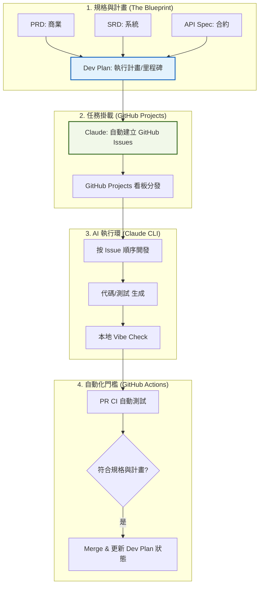
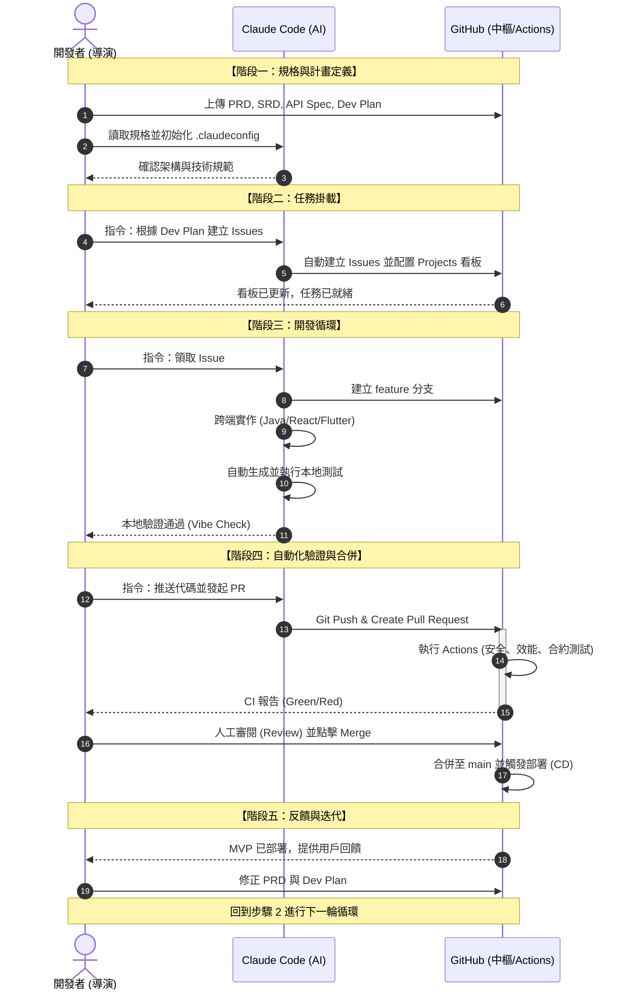

## 🚀 Vibe-SDLC 完整開發標準作業程序 (SOP) 5.0

### 第一階段：四重規格定義 (The Quad-Spec)

在 GitHub `/docs` 中建立所有真相來源。

1. **PRD.md**：商業功能與資料欄位（白話表格）。
2. **SRD.md**：系統架構、技術棧（Java/Flutter）、安全性與效能要求。
3. **API_Spec.yaml**：前後端通訊合約。
4. **Dev_Plan.md (新增)**：執行計畫。包含：
* **里程碑 (Milestones)**：例如 M1 (基礎設施)、M2 (核心交易)、M3 (UI 優化)。
* **任務拆解 (Task Breakdown)**：將功能細化為可執行的步驟。
* **依賴關係**：哪些功能必須先做（例如：先有資料庫，才能做登入）。

---

### 第二階段：任務自動化掛載 (Planning to Issues)

這是您強調的關鍵步驟：**將計畫轉換為追蹤工具。**

1. **計畫審核**：啟動 Claude，指令：`"讀取 docs/Dev_Plan.md，確認步驟是否遺漏了 SRD 中的安全實作。"`
2. **自動化建立 Issues**：
* **指令**：`"根據 Dev_Plan.md 中的 M1 里程碑，在 GitHub 上自動建立對應的 Issues，並標註優先級與標籤。"`

3. **看板同步**：GitHub Projects 會自動抓取這些 Issues，形成視覺化進度條。

---

### 第三階段：AI 噴射開發循環 (Execution Loop)

1. **按序取票**：開發者（導演）從 `Todo` 欄位挑選 Issue。
2. **精準實作**：
* **指令**：`"讀取 Issue #5，參考 SRD 的技術限制與 API_Spec 的格式，實作 feature 分支。"`

3. **本地守門**：AI 同步生成單元測試並在本地通過驗證。

---

### 第四階段：GitHub 自動化驗證 (CI/CD Gates)

1. **PR 發起**：Claude 總結變更並關聯 Issue。
2. **Actions 驗證**：執行合約測試、安全性掃描、與效能壓測。
3. **計畫更新**：當 PR Merge 後，GitHub Actions 或 Claude 自動將 `Dev_Plan.md` 中的對應步驟標記為 `Completed`。

---

### 第五階段：MVP 交付與迭代 (Release & Feedback)

1. **自動部署**：將產出推送到測試環境。
2. **回饋修正**：根據用戶回饋，先更新 `PRD` 與 `Dev_Plan`，再啟動下一輪循環。

---

### 🛠️ Vibe-SDLC SOP 5.0 流程圖

---

### 💡 為什麼將「開發計畫」轉為「Issues」至關重要？

* **避免遺漏**：計畫中提到的「系統監控」或「日誌備份」等非功能性任務，若沒變成 Issue，AI 往往會漏掉。
* **進度透明化**：非技術人員可以直接透過 GitHub 看板看到「計畫執行到哪一階段」，而不是看代碼行數。
* **上下文隔離**：Claude Code 在處理單一 Issue 時，會更專注，不會被無關的雜訊干擾。

---

### 接下來的具體產出建議

為了讓這套 SOP 完整落地，我們需要一份 **Dev_Plan.md 的範本**。

**您想讓我幫您產出這份購物網站專用的「開發計畫 (Dev Plan) 範本」嗎？**
我會將其拆解為四個階段：

1. **Foundation**（環境與資料庫）
2. **Core**（商品與交易邏輯）
3. **Multi-platform**（H5/Android 介面開發）
4. **Finalize**（安全性、壓測與部署）

您可以直接拿這份計畫讓 Claude 去幫您開 GitHub Issues。

-----------------------

這是一個非常好的切入點。透過**循序圖 (Sequence Diagram)**，我們可以清楚看到**開發者 (導演)**、**Claude Code (執行者)** 與 **GitHub (中樞系統)** 這三個角色在整個 Vibe-SDLC 週期中的互動與職責邊界。

### 重點摘要

* **開發者 (人類)**：負責定義高層級的「意圖」(PRD/SRD/Plan) 與最終的品質審核。
* **Claude Code (AI)**：負責跨端代碼實作、單元測試編寫與 Issue 自動化管理。
* **GitHub (系統)**：負責版本儲存、自動化測試執行 (Actions) 與 任務追蹤 (Projects)。

---

### Vibe-SDLC 循序圖

這個圖表展示了從專案啟動到 MVP 交付的完整互動流程：

---

### 角色職責明細表

為了讓 SOP 更易於執行，以下將各角色的具體職責條列化：

| 角色 | 核心職責 | 關鍵交付物 |
| --- | --- | --- |
| **開發者 (Dev)** | **方向決策與審核** 

 1. 定義商業與系統規範 

 2. 審查 API 欄位正確性 

 3. PR 邏輯最終確認 | PRD, SRD, Dev Plan |
| **Claude Code** | **自動化執行與修正** 

 1. 轉換規格為代碼與測試 

 2. 自動化 GitHub 任務管理 

 3. 根據 CI 報錯自我修正 | Code, Unit Tests, PR Summary |
| **GitHub** | **中樞管理與自動化檢驗** 

 1. 存放所有真相來源 (Docs) 

 2. 執行硬性指標檢驗 (Actions) 

 3. 追蹤任務進度 (Projects) | CI Reports, Artifacts (APK), Deployments |

---